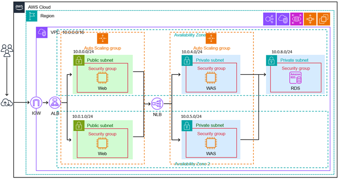

# vuln-assess-jm-collection

## 개요
2025년 5월 19-23일에 수행한 JM Collection 대상 취약점 진단 및 분석 프로젝트 기록용 저장소. 
JM Collection을 이름으로 하는 가상의 클라우드 기반 온라인 쇼핑몰 웹 서비스를 대상으로 6명의 인원으로 취약점 진단을 수행하였다. 
웹 서버 / WAS / 클라이언트 사이드 웹 인터페이스로 3개의 팀을 나누어 진행하였다. 
KISA의 **'2021 주요정보통신기반시설 기술적 취약점 기술적 취약점 분석·평가 방법 상세가이드'**(이하 주통기 가이드)를 기반으로 각 서비스의 환경에 맞춘 취약점 분석을 수행하였다. 
진단 결과 총 61건의 취약점이 발견되었으며, 각 취약점의 분석 내용과 조치 사항 등을 보고서로 작성하였다.

## 점검 대상 클라우드 아키텍처

두 개의 AZ를 걸친 로드 밸런싱과 오토 스케일링으로 고가용성을 보장하는 클라우드 아키텍처.

### 주요 구성 요소
- **VPC (10.0.0.0/16)**  
  Web/App/DB 서버를 모두 포함하는 논리적 네트워크 범위
- **Public Subnet (10.0.0.0/24, 10.0.1.0/24)**  
  - **Web Server**  
    클라이언트로부터 받은 HTTP/HTTPS 요청 처리. 
    OS : Ubuntu 22.04 LTS
  - **Security Group: Web**  
    HTTP/HTTPS 인바운드 허용 / 8009(AJP) 포트 아웃바운드 허용
- **Private Subnet (10.0.4.0/24, 10.0.5.0/24)**  
  - **Wep Application Server**  
    Web 서버에서 보낸 웹 애플리케이션 동작 요청 처리 
    OS : Windows Server 2019 Base
  - **Security Group: WAS** 
    NLB의 보안 그룹 인바운드 허용 / 1521(Oracle) 포트 아웃바운드 허용
- **Private Subnet (10.0.8.0/24)**
  - **RDS (Amazon RDS)**  
    Oracle DB 기반 데이터베이스 인스턴스. WAS에서 요청한 쿼리 수행
  - **Security Group: RDS** 
    1521(Oracle) 포트 인바운드 허용
    
- **네트워크 계층**  
  1. **IGW**: 인터넷 게이트웨이  
  2. **ALB**: Web 계층 로드밸런싱 (Internet Facing)
  3. **NLB**: WAS 계층 로드밸런싱 (Internal)

## 진단 방법

- 주통기 가이드를 참고하여 각 서버 환경에 맞게 진단 수행.
- Burp Suite, Kali Linux, nikto, dirb, sqlmap 등의 진단 도구 사용.
- 운영 서비스에 장애를 발생시키지 않는 범위 내에서 실제 공격과 동일한 방법으로 진단.

## 진단 결과 요약
| 구분                             | High | Medium | Low | Total |
|----------------------------------|:----:|:------:|:---:|:-----:|
| Web Server                         |  13  |   6   |  3  |  22   |
| Web Application Server (WAS)     |   12  |   9   |  3  |  24   |
| Client-side Web Interface (Web)  |   10  |    5   |  0  |  16   |
| **합계**                         | **35** | **20** | **6** | **61** |

## 촤종 보고서

[최종 보고서 (PDF)](/report/Final_report.pdf)